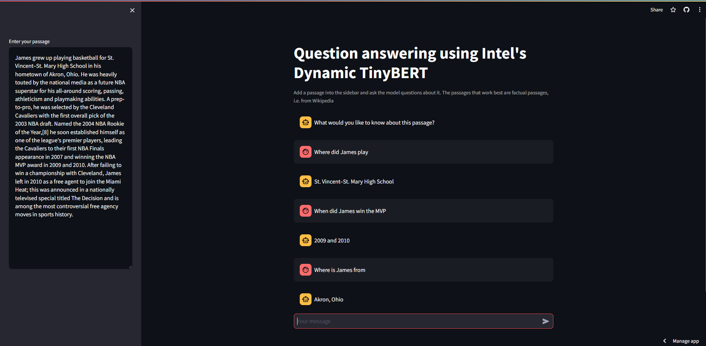

# ns380-wk9-miniproject

This project creates a chatbot with streamlit where you provide a passage (ideally one from Wikipedia or a similar factual source), then chat with the assistant asking questions about the passage. 

The underlying LLM in question is Intel's Dynamic TinyBERT model, which is based on the original Google BERT model. The Intel model is available with the Apache 2.0 license, making it available for use in this context.

The app is then served using Streamlit Cloud.

## Why TinyBERT?

TinyBERT is one of the smaller models available, but it's performance mirrors the original BERT, while also being significantly smaller. The model card is available [here](https://huggingface.co/Intel/dynamic_tinybert).

While BERT-Large is definitely better (93.2 F1 vs 88.7 F1), it is also much slower, as it has significantly more layers and therefore parameters in the model. The model card for TinyBERT shows the speedup over BERT-1% (an already smaller version of BERT) is 3.3x, AKA 1/3 of the time.

## Usage

To use this project you simply need to go to the website https://ns380-demo.streamlit.app/ and put in a passage and a query. Here is an example of the usage
